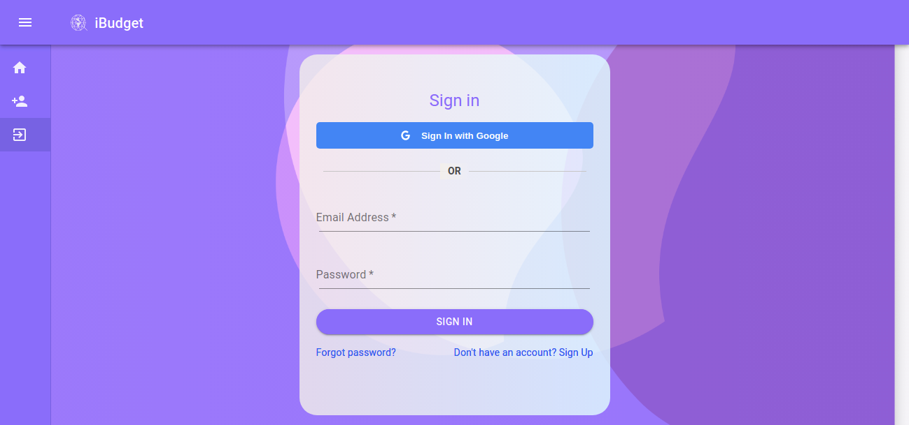
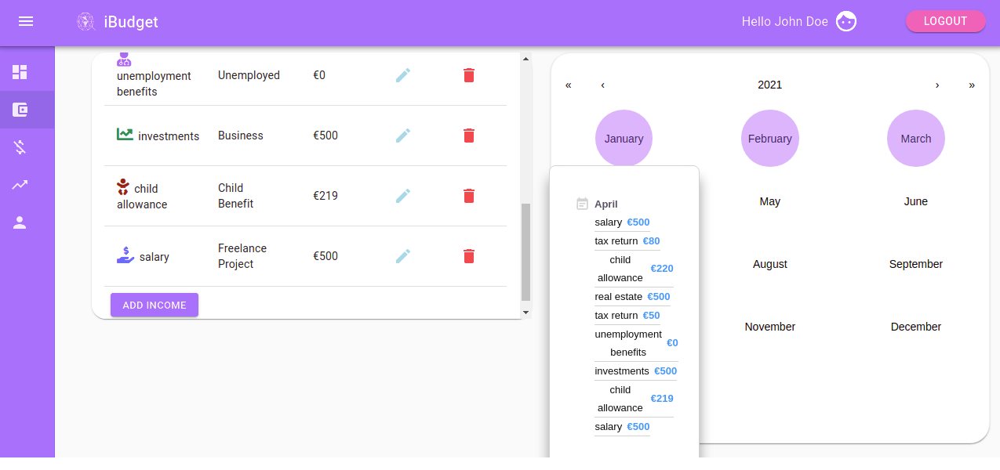
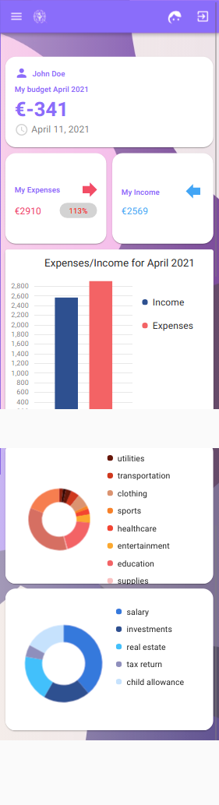
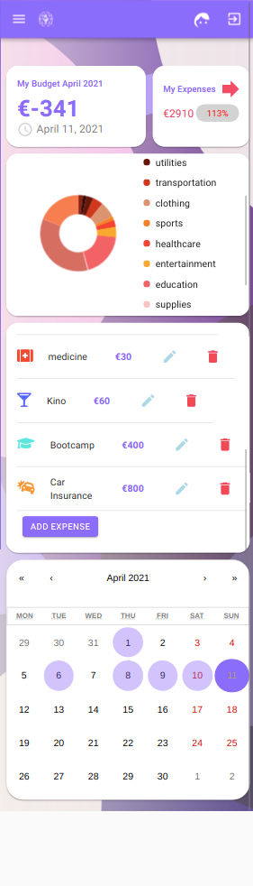

# IBUDGET APP

> FUll-Stack Project

## Table of contents

- [Title](#Title)
- [General Info](#General-Info)
- [Screenshots](#screenshots)
- [Technologies](#technologies)
- [Features](#features)
- [Status](#status)
- [Inspiration](#inspiration)
- [Contact](#contact)

## Title

IBUDGET.

## General Info

An IBudget full-stack app that helps its users with monthly budgeting planning in a well-organized manner. A team project created by 2 developers enhanced with a variety of charts and a calendar scheduler.

## Screenshots

## Technologies

- React.js
- Redux
- Redux-Saga
- TypeScript
- Material UI
- DevExtreme React Charts
- React Calendar
- Google Auth
- Local Storage
- Formik
- Node.js
- Express.js
- JSON Web Tokens
- MongoDB
- Mongoose

## Features

List of features READY and TODOs for future development

READY:

- Login with validation
- Register with validation
- Google Login
- Logout
- Add income/expense
- Remove income/expense
- Edit income/expense
- Total income/expense
- Save in Local Storage
- Calendar view
- Tile Content in Calendar
- Dashboard view
- Analytics view
- Bar charts
- Responsiveness
- Deployed in Heroku

To-do list:

- Add Currency Converter
- Improve Responsiveness
- Dockerize
- Create the Mobile version(Android and IOS)

## Status

Project is: _in progress_

## Inspiration

The goal was to create a digital solution for monthly budgeting planning in one place.

## Contact

Project is created by 2 developers [Michele Zucca](https://www.linkedin.com/in/michele-zucca/) and [Grigor Fanyan](https://www.linkedin.com/in/gregfanyan/) :
feel free to contact !
