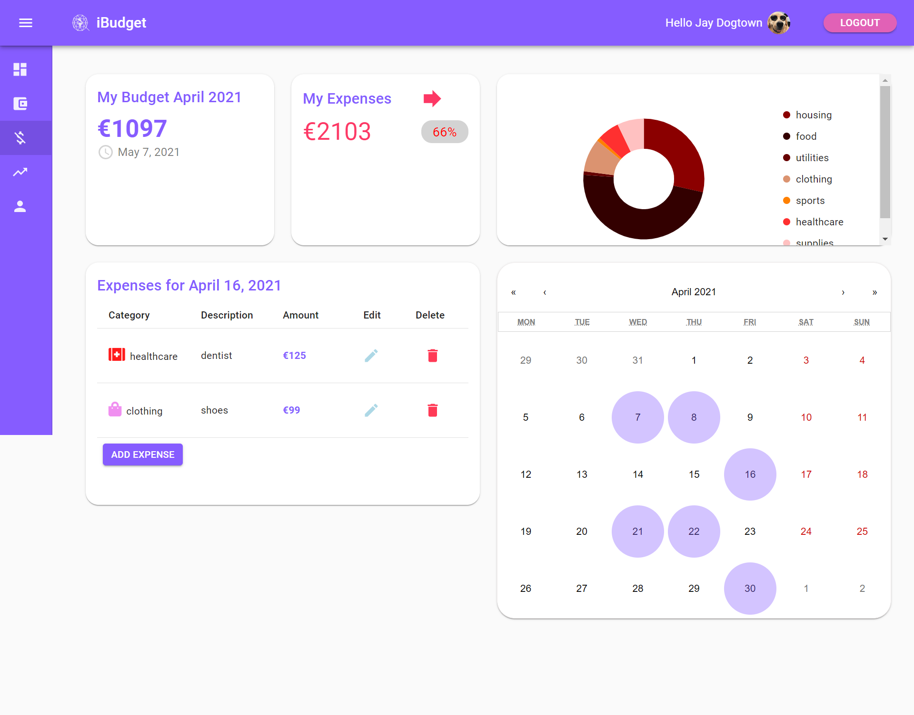

# IBUDGET APP

> FUll-Stack Project

## Table of contents

- [General Info](#General-Info)
- [Goal](#goal)
- [Tech Stack](#tech-stack)
- [Deployment](#deployment)
- [Home](#home)
- [Authentication](#authentication)
- [Dashboard](#dashboard)
- [Income](#income)
- [Expenses](#expenses)
- [Analytics](#analytics)
- [User Profile](#user-profile)
- [Mobile Version](#mobile-version)
- [Features](#features)
- [Status](#status)
- [Contact Us](#contact-us)

## General Info

iBudget is a full-stack app that helps your monthly budgeting planning in a well-organized manner. This team project was created by two developers and features a variety of charts and a calendar scheduler.

## Goal

The goal was to create a digital solution for monthly budgeting planning in one place.

## Tech Stack

- React.js
- Redux
- Redux-Saga
- TypeScript
- Material UI
- DevExtreme React Charts
- React Calendar
- Google Auth
- Local Storage
- Formik
- Node.js
- Express.js
- JSON Web Tokens
- MongoDB
- Mongoose

## Deployment 

The app is deployed on Heroku. You can try out our demo on https://ibudget-app.herokuapp.com/

## Home

## Authentication

Users can either register and login in their account with their email and password or register with Google authentication. 

## Dashboard

From their dashboard, users can have an overview of all data from the current month. Data for income, expenses, monthly budget and different charts for income and expenses are displayed.

## Income

The income page displays all income data. Users have a year calendar where they can add all monthly incomes divided by categories for each month. Users have 5 different types of income categories and can add, edit or delete income categories per month, displayed in a income table. The calendar switches between years and updates in real time with an overview of monthly income displayed in a highlighted tile content. Users have also access to a category chart that updates in real time when adding, editing or deleting income data. Monthly budget and income is updated on real time.

## Expenses

Users can track all monthly expenses on the expenses page. The calendar shown in the expenses pages is a monthly calendar, which displays all daily data regarding expenses, including total expenses for the month and monthly budget. Users can select between 12 type of expenses categories and add, edit and delete expenses which are displayed on the expenses table. Just like the income page, tile contents can highlight daily expenses on the calendar which can be viewed by hovering on the calendar days. An expenses chart by categories updates on real time when data is added, edit or deleted.

## Analytics

The analytics page gives an overview of all year and monthly expenses and income, with year and monthly budget. User can switch between year and monthly view. While on year view, the user can see the total amount of expenses, income and total budget, together with a decade calendar and a chart displaying all expenses and income for the selected year. By switching to month view and clicking to different months, the user can view an aggregate of all expenses and income per month in a year calendar, and a monthly chart displaying total expenses and income.

## User Profile

Users can view their details, like registered name and email address on the user’s profile. If the user has registered a new account directly with the iBudget app, the details can be edited.

## Mobile

The app is mobile responsive. 

## Status

Project is: _in progress_. MVP has been finalized, with some bug fixes still in place.

## Features

List of features READY and TODOs for future development

READY:

- Login with validation
- Register with validation
- Google Login
- Logout
- Add income/expense
- Remove income/expense
- Edit income/expense
- Total income/expense
- Save in Local Storage
- Calendar view
- Tile Content in Calendar
- Dashboard view
- Analytics view
- Bar charts
- Responsiveness
- Deployed in Heroku

To-do list:

- Add more oauth types (Facebook, Twitter)
- Add Currency Converter
- Improve calendar functionality
- Create an automated functionality for adding income/expenses
- Improve Responsiveness
- Dockerize
- Create the Mobile version(Android and IOS)

## Contact Us

The project is created by 2 developers [Michele Zucca](https://www.linkedin.com/in/michele-zucca/) and [Grigor Fanyan](https://www.linkedin.com/in/gregfanyan/) :
feel free to contact us if you have any questions!
